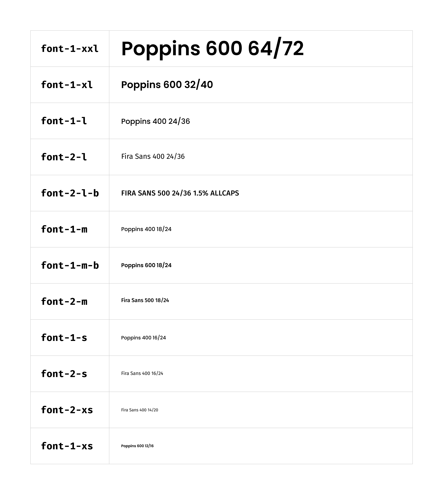
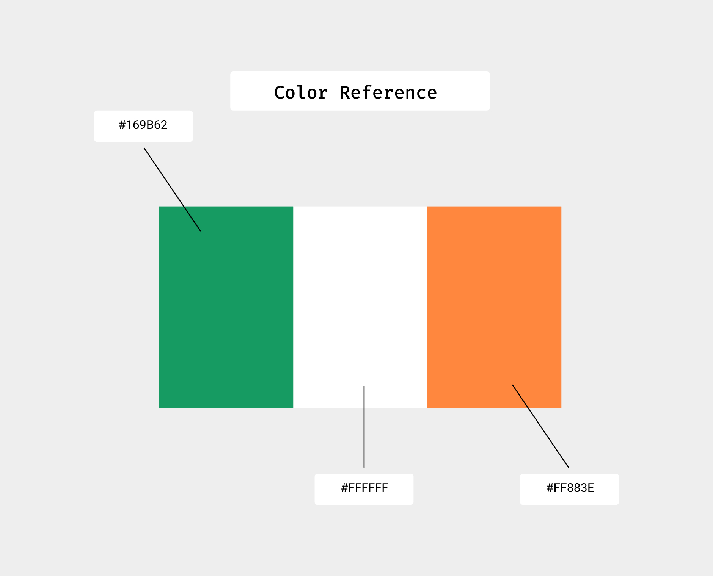
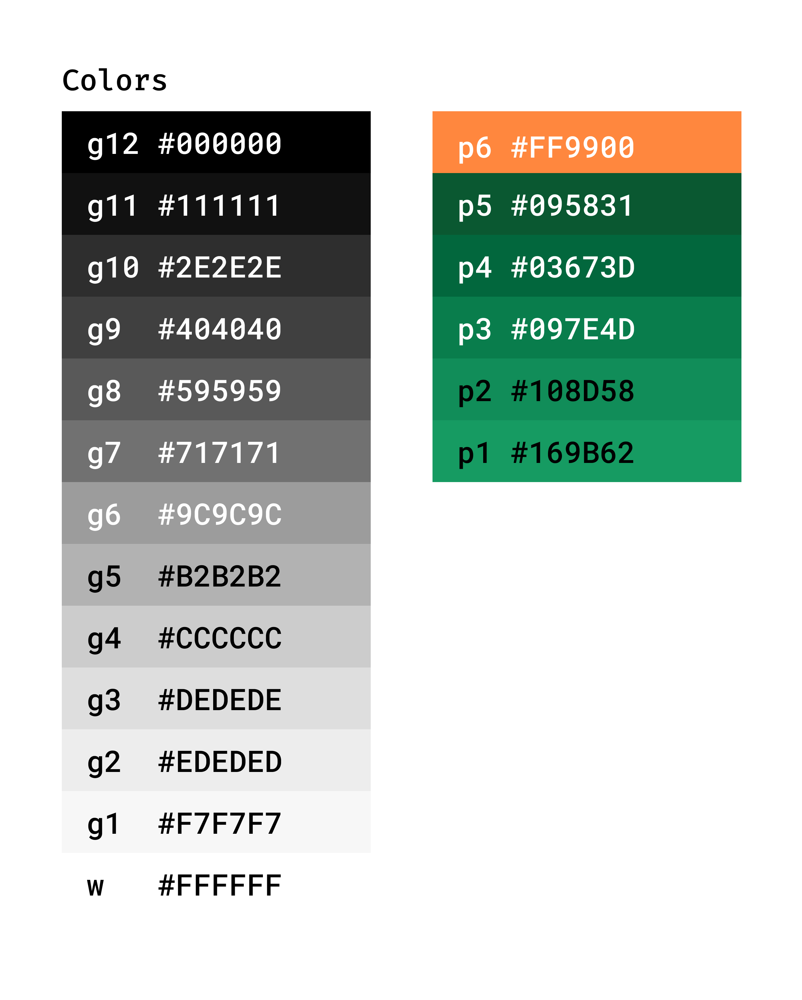
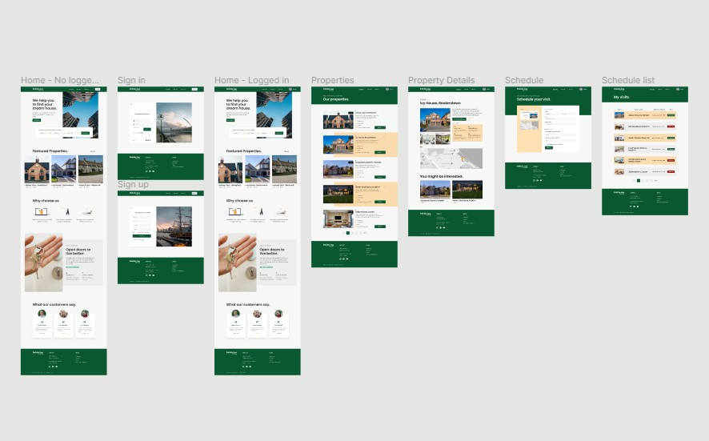
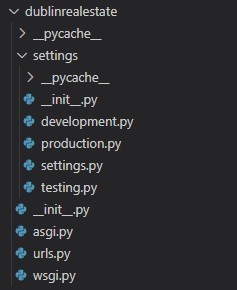
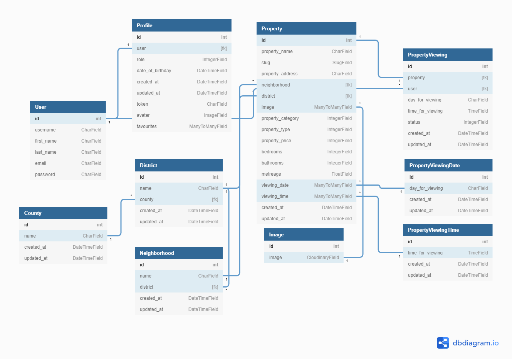

# Dublin Inn Real Estate

# Table of Contents

- [Dublin Inn Real Estate](#dublin-inn-real-estate)
- [Table of Contents](#table-of-contents)
- [Briefing](#briefing)
  - [Challenge](#challenge)
  - [Business Rules](#business-rules)
  - [Screens](#screens)
- [User Experience | UX](#user-experience--ux)
  - [Goals](#goals)
    - [Visitor Goals](#visitor-goals)
    - [User Stories](#user-stories)
      - [User](#user)
      - [Admin](#admin)
      - [Developer](#developer)
  - [Design Choices](#design-choices)
    - [Typography](#typography)
    - [Color palette](#color-palette)
- [User Interface | UI](#user-interface--ui)
  - [Skeleton](#skeleton)
- [Information Architecture](#information-architecture)
  - [Project settings files configuration structure](#project-settings-files-configuration-structure)
    - [Development environment](#development-environment)
    - [Testing environment](#testing-environment)
    - [Production environment](#production-environment)
  - [Data Storage](#data-storage)
    - [Database schema](#database-schema)
    - [User Table](#user-table)
    - [Profile Table](#profile-table)
    - [Property Table](#property-table)
    - [County Table](#county-table)
    - [District Table](#district-table)
    - [Neighborhood Table](#neighborhood-table)
    - [PropertyViewing Table](#propertyviewing-table)
    - [PropertyViewingDate Table](#propertyviewingdate-table)
    - [PropertyViewingTime Table](#propertyviewingtime-table)
- [Technologies Used](#technologies-used)
  - [Languages](#languages)
  - [Frameworks](#frameworks)
  - [Libraries](#libraries)
  - [Tools](#tools)
- [Acknowledgements](#acknowledgements)
- [Disclaimer](#disclaimer)
- [Author](#author)

# Briefing

**Dublin Inn Real Estate** is a specialist rental company across Ireland. Based in Dublin, the company has a simple website that receives around 2,000 simultaneous hits per day.

In just over 1 year of the website, the marketing team of **Dublin Inn Real Estate** noticed that the volume of access to the website was falling, contributing with a significant portion of the company's revenue.

Based on this information, the team of analysts decided to investigate the reason for the decrease in access and found that the site had become obsolete and the system no longer supported the number of daily accesses, which required a redesign of the entire web application. Therefore, the marketing team launched a proposal to innovate the company's visual identity.

## Challenge

Concerned about this metric falling, the CEO of **Dublin Inn Real Estate** hired me to develop a new web application for the company.

At the end of the work, it is expected that a new application will be delivered, with a new identity, new functionalities, reliable and scalable, which supports more simultaneous accesses than the old website.

The company's business team gave me a report on the features that the CEO wants:

> 1. A website whose purpose of the company is immediately understood by the user.
> 2. Have a clear information on what the site is about and what it provides
> 3. Have an easy navigation that is consistent throughout the website
> 4. Consistent layout without any confusing elements
> 5. Accessibility considerations are taken throughout the site
> 6. A form where the user can filter the search by properties, passing information such as location, property type and price range (*This functionality does not exist in the current application*).
> 7. A functionality where the user can schedule a visit to one or more properties and a dashboard where he can view, edit and/or delete a visit (*This functionality does not exist in the current application*).

## Business Rules

The application's administrative functions are intended to manage what each user can do within the system. Permissions such as adding, editing or removing a property, for example, should under no circumstances be given to the user of the application. Such functionalities must be assigned exclusively to the administrator.

In the system, there will be the following user functionalities:

   - Admin: has permission in all areas of the system.
   - Users: can edit your own profile like change profile picture or change password. The user can search for properties by **location**, **type** of property (apartment, house, studio, etc.), **price range**, in addition to being able to schedule visits, edit date and time of visit (according to availability) and you can also cancel a certain scheduled visit.

## Screens

- Admin:
    - will be able to manage users.
    - Add/Edit/Remove properties.
    - View all screens users can view as well.
- Users:
    - can log in and out of the application.
    - manage his/her own profile.
    - form to search for properties.


[Back to top ⇧](#table-of-contents)


# User Experience | UX

## Goals

### Visitor Goals

- Provide access to high standard properties for visitors to browse
- Give potential clients a testimonial from previous clients about their satisfaction using the company's services.
- Allow visitors the option to book a property visit directly from the site.
- Allow the visitor to be able to search for a property according to its location, type of property (Studio, Apartment or House) and price.
- Allow the visitor to be able to create an account and manage their own content in the site.

### User Stories

#### User

- As a **Site User** I can **register an account** so that **I can favourite the properties I like and book a visit**.
- As a **Site User** I can **filter a property according to its price** so that **I can choose the one that best suits my budget**.
- As a **Site User** I can **filter a property according to its type** so that **I can choose the one that fits on my needs**.
- As a **Site User** I can **filter a property according to its location** so that **I can choose the one that are of interest to me**.
- As a **Site User** **I can click on a property** so that **I can read the full content**.
- As a **Site User** I can **schedule a day and time** so that **I can visit the property when it's convenient for me**.
- As a **Site User** I can **see all visits scheduled as well as modify or cancel** so that **I can manage my scheduled visits**.
- As a **Site User**, I expect to **have a button** so that I can sign up for the site using my **Facebook** or **Gmail accounts**.

#### Admin

- As a **Site Admin** I want to be able to **add a new property easily**.
- As a **Site Admin** I want to be able to **see all existing properties** in a simple and easy manner.
- As a **Site Admin** I want to be able to **manage the existing properties such as edit price or delete** easily.

#### Developer

- As a **Developer** I want to ensure that **all application features work** as they were implemented to work.
- As a **Developer** I want to ensure **an authenticated user can access** all required information correctly.
- As a **Developer** I want to **work together with the administrator** of the site for **improvements** for the user of the same.


## Design Choices

### Typography

As a primary font, I have chosen to use [Poppins](https://fonts.google.com/specimen/Poppins) as it has a geometric in style, clean, and includes 18 different font weights, from thin to black. Also, Poppins is great for both headlines and paragraph copy to improve readability and style.

As a secondary font I have chosen to use [Fira Sans](https://fonts.google.com/specimen/Fira+Sans) to compliment the site content and allow for the extra content to stand out from the rest of the site content. Furthermore, the Fira font family also aim to cover the legibility needs for a large range of handsets varying in screen quality and rendering.

For the Logo I have chosen to use [Gorditas](https://fonts.google.com/specimen/Gorditas) because it is a fun and funky display slab **serif typeface family**, with heart details, which fit perfectly into the design thought for the project.



### Color palette

Talking to the marketing team at **Dublin Inn Real Estate**, they informed me that the CEO would like the site to have references to the colors of the Irish flag.



With this information I have chosen to use the following colours to provide a great contrast and to help the content stand out.



[Back to top ⇧](#table-of-contents)

# User Interface | UI

## Skeleton

The wireframes were created in [Figma](https://www.figma.com/) which can be explored in details by clicking on the image below 👇

<div style="text-align: center;">
  <a href="https://www.figma.com/file/KoyTeoW0AqOFKs9dxQ0u1R/Dublin-Inn-Real-Estate?node-id=0%3A1">
    
  </a>
</div>

# Information Architecture

## Project settings files configuration structure

The configuration file is one of the most important elements in any Django project. Knowing this, I decided to divide the configuration files structure into four files, one of them being the base file, which will contain everything that is needed in any project environment, be it **production**, **development** or **testing**. The other three files are for development, testing and finally production environments.

For that, create a folder called `settings` inside the main project folder. Inside it, add the `development.py`, `testing.py`, `production.py` and `__init__.py` files. After that, take the base `settings.py` file (which is in the root of the main project folder) and move it into the settings folder.

We will do this so that within the `settings.py` file there are only elements that will be used in any of the environments, be it production, testing or development. However, whatever we need to create differently for each environment, we will put it in the files we just created.

For this project, both the development and test environments use the `sqlite` database locally, while the production environment uses the `Postgresql` database. That way, development and testing data doesn't mix with the data that will be in production. To do this kind of separation, we must place the database settings in their respective files.

See below how the project structure should look 👇



Now, we will need to open each file and add some settings.

### Development environment

```
from .settings import *

DEBUG = True

SECRET_KEY = # past your own secret key here
ALLOWED_HOSTS = ["localhost", "127.0.0.1"]

DATABASES = {
    'default': {
        'ENGINE': 'django.db.backends.sqlite3',
        'NAME': BASE_DIR / 'db.sqlite3',
    }
}

```

### Testing environment

```
from .settings import *

DEBUG = True
SECRET_KEY = # past your own secret key here
ALLOWED_HOSTS = ['localhost', '127.0.0.1']

DATABASES = {
    'default': {
        'ENGINE': 'django.db.backends.sqlite3',
        'NAME': BASE_DIR / 'db.sqlite3',
    }
}
```

### Production environment

```
import os
import dj_database_url
from .settings import *

if os.path.exists("env.py"):
    import env

DEBUG = False
SECRET_KEY = os.environ.get("SECRET_KEY_PRODUCTION")
ALLOWED_HOSTS = [os.environ.get("HEROKU_HOST")]

DATABASES = {'default': dj_database_url.parse(os.environ.get("HEROKU_DB"))}

```

Remembering that it is good programming practices not to leave SECRET_KEYS visible as this will result in the vulnerability of the application. Therefore, generate your own secret keys and configure them through environment variables.

You can use Python `os` library to set your environment variables and then import them into the files, as I exemplify below:

```
import os

# SECRET KEYS
os.environ.setdefault("SECRET_KEY_DEVELOPMENT", "YOUR SECRET KEY")
os.environ.setdefault("SECRET_KEY_PRODUCTION", "YOUR SECRET KEY")
os.environ.setdefault("SECRET_KEY_TESTING", "YOUR SECRET KEY")

```
Once that's done, don't forget to remove the database settings and secret key from the `settings.py` file.

It is worth mentioning that with this change in the project structure, you will need to change some more settings, so that the application works correctly. By default, in the `settings.py` file, the `BASE_DIR` variable looks like this: `BASE_DIR = Path(__file__).resolve().parent.parent`. You will need to add a new `.parent` as there has been a subdivision of the main project folder. So the `BASE_DIR` variable should look like this: `BASE_DIR = Path(__file__).resolve().parent.parent.parent`.

Also, in the `wsgi.py` file you will need to notice that by default, the environment variable setting will look like this:

```
import os

from django.core.wsgi import get_wsgi_application

os.environ.setdefault("DJANGO_SETTINGS_MODULE",
                      "dublinrealestate.settings")

application = get_wsgi_application()
```

Since three independent environments were created, we need to tell Django which environment we are going to work with. In this way, it is necessary to add, right after `settings`, the environment name.

If working in the development environment, add `.development`. If working in the testing environment, add `.testing` and so on.

The same thing should apply to the `manage.py` file which by default appears as

```
import os
import sys


def main():
    """Run administrative tasks."""
    os.environ.setdefault('DJANGO_SETTINGS_MODULE',
                          'dublinrealestate.settings')

    # The rest of the code was hidden to optimize the page. Do not remove anything after this line.
    ...
```

If working in the development environment, add `.development` after `settings`. If working in the testing environment, add `.testing` and so on.

Be sure to change it each time you are working in a different environment.

## Data Storage

### Database schema




### User Table

| Title          | Key In Database | Form Validation           | Data Type   |
| -------------- | --------------- | ------------------------- | ----------- |
| id             | id              | No Validation             | Primary Key |
| Username       | username        | max_length 20             | CharField   |
| First Name     | first_name      | max_lenght 20             | CharField   |
| Last Name      | last_name       | max_lenght 20             | CharField   |
| E-mail Address | email           | Must contain @ & .com etc | Email       |
| Password       | password        | max length 50             | CharField   |


### Profile Table

Once a user registers in the system, a profile is automatically created for that user.

| Title            | Key In Database  | Form Validation                     | Data Type       |
| ---------------- | ---------------- | ----------------------------------- | --------------- |
| Id               | id               | No Validation                       | Primary Key     |
| user             | user             | max length 50                       | Foreign Key     |
| Role             | role             | choices=ROLE_CHOICE*, default=2     | IntegerField    |
| Date of Birthday | date_of_birthday | default=None, null=True, blank=True | DateTimeField   |
| Created at       | created_at       | auto_now_add=True                   | DateTimeField   |
| Updated at       | updated_at       | auto_now_add=True                   | DateTimeField   |
| Token            | token            | max_length=255                      | CharField       |
| Avatar           | avatar           | default='placeholder'               | ImageField      |
| Favourites       | favourites       | blank=True                          | ManyToManyField |

* ROLE_CHOICE = (
    (1, 'Admin'),
    (2, 'Client'),
    (3, 'Agent')
)


### Property Table

|       Title       |  Key In Database  |             Form Validation             |    Data Type    |
| :---------------: | :---------------: | :-------------------------------------: | :-------------: |
|        Id         |        id         |              No Validation              |   Primary Key   |
|   Property Name   |   property_name   | max_length=50, null=False, unique=True  |    CharField    |
|       Slug        |       slug        | max_length=100, null=False, unique=True |    SlugField    |
| Property Address  | property_address  |             max_length=255              |    CharField    |
|   Neighborhood    |   neighborhood    |                null=True                |   Foreign Key   |
|     District      |     district      |              No Validation              |   Foreign Key   |
|       Image       |       image       |               blank=True                | ManyToManyField |
| Property Category | property_category |  choices=PROPERTY_CATEGORY*, default=2  |  IntegerField   |
|   Property Type   |   property_type   |    choices=PROPERTY_TYPE*, default=1    |  IntegerField   |
|  Property Price   |  property_price   |              No Validation              |  IntegerField   |
|     Bedrooms      |     bedrooms      |              No Validation              |  IntegerField   |
|     Bathrooms     |     bathrooms     |              No Validation              |  IntegerField   |
|     Metreage      |     metreage      |              No Validation              |   FloatField    |
|   Viewing Date    |   viewing_date    |              No Validation              | ManyToManyField |
|   Viewing Time    |   viewing_time    |              No Validation              | ManyToManyField |
|    Created at     |    created_at     |            auto_now_add=True            |  DateTimeField  |
|    Updated at     |    updated_at     |            auto_now_add=True            |  DateTimeField  |


* PROPERTY_CATEGORY = (
    (1, 'Sale'),
    (2, 'Rent')
)


* PROPERTY_TYPE = (
    (1, 'Studio'),
    (2, 'Apartment'),
    (3, 'House')
)


### County Table

| Title      | Key in Database | Form Validation   | Data Type     |
| ---------- | --------------- | ----------------- | ------------- |
| Id         | id              | No Validation     | Primary Key   |
| Name       | name            | max length 50     | CharField     |
| Created at | created_at      | auto_now_add=True | DateTimeField |
| Updated at | updated_at      | auto_now_add=True | DateTimeField |


### District Table

| Title      | Key in Database | Form Validation           | Data Type     |
| ---------- | --------------- | ------------------------- | ------------- |
| Id         | id              | No Validation             | Primary Key   |
| Name       | name            | max length 50             | CharField     |
| County     | county          | on_delete=models.SET_NULL | Foreign Key   |
| Created at | created_at      | auto_now_add=True         | DateTimeField |
| Updated at | updated_at      | auto_now_add=True         | DateTimeField |


### Neighborhood Table

| Title      | Key in Database | Form Validation           | Data Type     |
| ---------- | --------------- | ------------------------- | ------------- |
| Id         | id              | No Validation             | Primary Key   |
| Name       | name            | max length 50             | CharField     |
| District   | district        | on_delete=models.SET_NULL | Foreign Key   |
| Created at | created_at      | auto_now_add=True         | DateTimeField |
| Updated at | updated_at      | auto_now_add=True         | DateTimeField |


### PropertyViewing Table

| Title            | Key In Database  | Form Validation                    | Data Type     |
| ---------------- | ---------------- | ---------------------------------- | ------------- |
| Id               | id               | No Validation                      | Primary Key   |
| Property         | property         | on_delete=models.SET_NULL          | Foreign Key   |
| User             | user             | on_delete=models.SET_NULL          | Foreign Key   |
| Day for viewing  | day_for_viewing  | null=False, max_length=20          | CharField     |
| Time for viewing | time_for_viewing | No Validation                      | TimeField     |
| Status           | status           | choices=VIEWING_STATUS*, default=1 | IntegerField  |
| Created at       | created_at       | auto_now_add=True                  | DateTimeField |
| Updated at       | updated_at       | auto_now_add=True                  | DateTimeField |


* VIEWING_STATUS = (
    (1, 'Scheduled'),
    (2, 'Cancelled')
)

### PropertyViewingDate Table

| Title           | Key in Database | Form Validation           | Data Type     |
| --------------- | --------------- | ------------------------- | ------------- |
| Id              | id              | No Validation             | Primary Key   |
| Day for viewing | day_for_viewing | null=False, max_length=20 | CharField     |
| Created at      | created_at      | auto_now_add=True         | DateTimeField |
| Updated at      | updated_at      | auto_now_add=True         | DateTimeField |

### PropertyViewingTime Table

| Title            | Key in Database  | Form Validation   | Data Type     |
| ---------------- | ---------------- | ----------------- | ------------- |
| Id               | id               | No Validation     | Primary Key   |
| Time for viewing | time_for_viewing | No Validation     | TimeField     |
| Created at       | created_at       | auto_now_add=True | DateTimeField |
| Updated at       | updated_at       | auto_now_add=True | DateTimeField |


[Back to top ⇧](#table-of-contents)


# Technologies Used

## Languages

1. **HTML5, or Hyper Text Markup Language:** Used to construct the page within this app -   
https://developer.mozilla.org/en-US/docs/Web/HTML

2. **CSS3, or Cascading Style Sheets:** Used to style the various elements on the app's pages via coloring, fonts, spacing, etc. - 
https://www.w3.org/Style/CSS/Overview.en.html

3. **Javascript:** Used to create iterations across the page. - https://www.javascript.com/

4. **Python:** Used to develop all application logic. (https://www.python.org/)

## Frameworks

- [Django](https://www.djangoproject.com/)
- [Jquery](https://jquery.com/)

## Libraries

- [Django Allauth](https://django-allauth.readthedocs.io/en/latest/installation.html)

## Tools

- [Heroku](https://www.heroku.com)
- [Git](https://git-scm.com/)
- [Postgres](https://www.postgresql.org/)
- [Db Diagram](https://dbdiagram.io/home)
- [Figma](https://figma.com)


[Back to top ⇧](#table-of-contents)

# Acknowledgements

I would like to take the opportunity to thank:

 - To God first, to my family, friends and colleagues for their advice, support and help with testing.
 - To my mentors Felipe Alarcon & Richard Wells for their feedback, advices, support and, above all, for their patience.
 - All Code Institute Tutors and Community on Slack for the peer reviews and advice.


# Disclaimer

> ****Disclaimer***: The following Context is completely fictional, the company, the context, the CEO, the business questions exist only in my imagination.

> **For educational purposes only.

# Author

Made with ❤️ by <b>Emidio Valereto</b>  Get in touch!

[](https://www.linkedin.com/in/emidiovalereto/) [](mailto:emidio.valereto@gmail.com)

[Back to top ⇧](#table-of-contents)